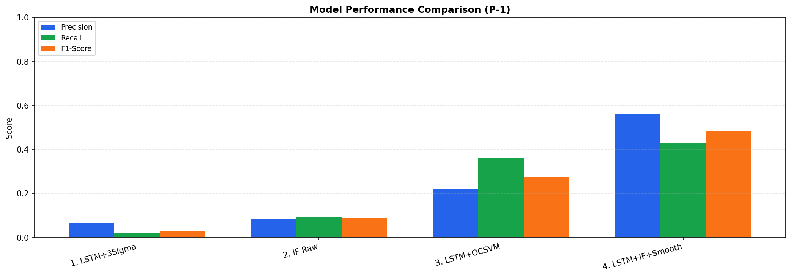
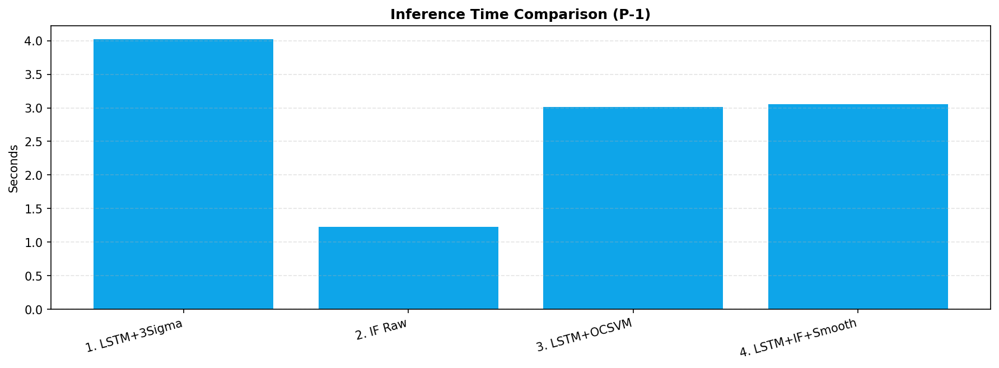

# Model Comparison Report — SMAP Anomaly Detection

**Channel**: `P-1`

## Tóm tắt các mô hình

| # | Tên mô hình | Mô tả ngắn |
|---|-------------|------------|
| 1 | **LSTM + 3-Sigma** | Ngưỡng toán học cố định, không có IF/Smoothing |
| 2 | **Standard IF (Raw Data)** | IF trực tiếp trên dữ liệu thô, không qua LSTM |
| 3 | **LSTM + OCSVM** | Thay IF bằng OCSVM trên cùng vector 5D residuals |
| 4 | **LSTM + IF + Smoothing** | Pipeline đầy đủ (mô hình chính) |

## Kết quả so sánh

| Mô hình | Precision | Recall | F1-Score | FP | FN | #Pred Anomaly | Time (s) |
|---------|-----------|--------|----------|-----|-----|---------------|----------|
| 1. LSTM + 3-Sigma | 0.0651 | 0.0186 | 0.0290 | 201 | 737 | 215 | 4.02 |
| 2. Standard IF (Raw Data) | 0.0827 | 0.0932 | 0.0877 | 776 | 681 | 846 | 1.23 |
| 3. LSTM + OCSVM | 0.2206 | 0.3622 | 0.2742 | 961 | 479 | 1233 | 3.01 |
| 4. LSTM + IF + Smoothing (Main) | 0.5610 | 0.4288 | 0.4860 | 252 | 429 | 574 | 3.05 |

## Biểu đồ tổng hợp






## Phân tích chi tiết từng mô hình

### 1. LSTM + 3-Sigma

- **Precision**: 0.0651
- **Recall**: 0.0186
- **F1-Score**: 0.0290
- **True Positives (TP)**: 14
- **False Positives (FP)**: 201  ← cảnh báo giả
- **False Negatives (FN)**: 737  ← bỏ lọt anomaly
- **True Negatives (TN)**: 7453
- **Tổng điểm dự đoán là anomaly**: 215
- **Tổng điểm anomaly thật**: 751
- **Thời gian inference**: 4.02 giây
- **Ngưỡng sử dụng**: 0.460625

```
              precision    recall  f1-score   support

Anomaly (-1)       0.07      0.02      0.03       751
  Normal (1)       0.91      0.97      0.94      7654

    accuracy                           0.89      8405
   macro avg       0.49      0.50      0.48      8405
weighted avg       0.83      0.89      0.86      8405

```

### 2. Standard IF (Raw Data)

- **Precision**: 0.0827
- **Recall**: 0.0932
- **F1-Score**: 0.0877
- **True Positives (TP)**: 70
- **False Positives (FP)**: 776  ← cảnh báo giả
- **False Negatives (FN)**: 681  ← bỏ lọt anomaly
- **True Negatives (TN)**: 6878
- **Tổng điểm dự đoán là anomaly**: 846
- **Tổng điểm anomaly thật**: 751
- **Thời gian inference**: 1.23 giây
- **Ngưỡng sử dụng**: 0.000000

```
              precision    recall  f1-score   support

Anomaly (-1)       0.08      0.09      0.09       751
  Normal (1)       0.91      0.90      0.90      7654

    accuracy                           0.83      8405
   macro avg       0.50      0.50      0.50      8405
weighted avg       0.84      0.83      0.83      8405

```

### 3. LSTM + OCSVM

- **Precision**: 0.2206
- **Recall**: 0.3622
- **F1-Score**: 0.2742
- **True Positives (TP)**: 272
- **False Positives (FP)**: 961  ← cảnh báo giả
- **False Negatives (FN)**: 479  ← bỏ lọt anomaly
- **True Negatives (TN)**: 6693
- **Tổng điểm dự đoán là anomaly**: 1233
- **Tổng điểm anomaly thật**: 751
- **Thời gian inference**: 3.01 giây

```
              precision    recall  f1-score   support

Anomaly (-1)       0.22      0.36      0.27       751
  Normal (1)       0.93      0.87      0.90      7654

    accuracy                           0.83      8405
   macro avg       0.58      0.62      0.59      8405
weighted avg       0.87      0.83      0.85      8405

```

### 4. LSTM + IF + Smoothing (Main)

- **Precision**: 0.5610
- **Recall**: 0.4288
- **F1-Score**: 0.4860
- **True Positives (TP)**: 322
- **False Positives (FP)**: 252  ← cảnh báo giả
- **False Negatives (FN)**: 429  ← bỏ lọt anomaly
- **True Negatives (TN)**: 7402
- **Tổng điểm dự đoán là anomaly**: 574
- **Tổng điểm anomaly thật**: 751
- **Thời gian inference**: 3.05 giây
- **Ngưỡng sử dụng**: 0.013477

```
              precision    recall  f1-score   support

Anomaly (-1)       0.56      0.43      0.49       751
  Normal (1)       0.95      0.97      0.96      7654

    accuracy                           0.92      8405
   macro avg       0.75      0.70      0.72      8405
weighted avg       0.91      0.92      0.91      8405

```

## Luận điểm chứng minh

### 1. LSTM + 3-Sigma → Cảnh báo giả tràn lan
Ngưỡng `mean + 3σ` là một hằng số tĩnh. Vì residuals trong SMAP có phân phối lệch nặng (heavy-tailed), ngưỡng này **quá thấp** so với vùng biên thực tế, dẫn đến hàng trăm false positives trong mỗi cửa sổ bình thường.

### 2. Standard IF (Raw Data) → Bỏ lọt lỗi ngữ cảnh
Dữ liệu thô không phản ánh **sự lệch khỏi ngữ cảnh thời gian** mà chỉ phản ánh giá trị tuyệt đối. IF trên raw data có thể phân biệt outlier tĩnh, nhưng bỏ lọt các anomaly kéo dài (contextual anomaly) mà LSTM có thể phát hiện qua residuals.

### 3. LSTM + OCSVM → Thua về tốc độ và robustness
OCSVM phải tính ma trận kernel O(n²), rất chậm với dữ liệu lớn. Hơn nữa, OCSVM nhạy cảm với outlier trong training data và tham số `gamma`, `nu` khó tune. IF với phân chia ngẫu nhiên O(n·log n) bền vững hơn và nhanh hơn.

### 4. LSTM + IF + Smoothing → Tốt nhất
Pipeline đầy đủ: LSTM trích xuất lỗi ngữ cảnh → IF phát hiện outlier trong không gian residuals → Temporal Smoothing loại bỏ FP đơn lẻ và gộp cụm anomaly gần nhau → PR-Curve calibration tìm ngưỡng tối ưu.
