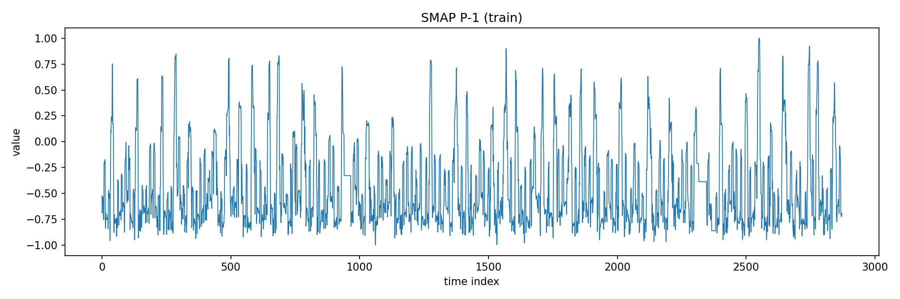

# SMAP EDA Report

Channel: P-1
Split: train

## Answers (light EDA)
- Number of channels: 25
- Univariate or multivariate: Multivariate
- Sampling regular: Unknown (no timestamps)
- Missing values: 0 (0.000000)
- Value scale (min/max/mean/std): -1.000000 / 1.000000 / 0.002857 / 0.183641
- Label format: not found
- Label coverage: 0 points (0.000000)
- Sequence length: 2872

## Plot

## Data Contract (to freeze after EDA)
WINDOW_SIZE = TBD
N_FEATURES = TBD
PREDICTION_DIM = TBD
ROLLING_WINDOW = TBD

## Notes
- This report is a light EDA focused on the 7 questions only.
- If you switch to multivariate, update N_FEATURES and re-run.